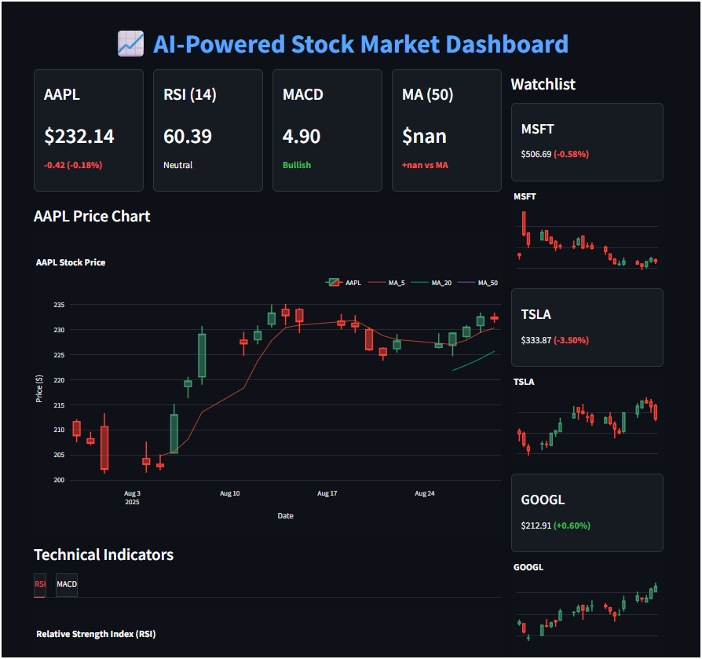

📈 AI-Powered Stock Market Dashboard

Your personal Bloomberg-lite terminal, right inside Python.

This project brings the power of real-time market data, technical analysis, sentiment insights, and a professional trading UI into one dashboard. Built with Streamlit, Pandas, Plotly, yfinance, and WebSockets, it transforms your laptop into a mini trading terminal.

✨ What Makes It Special?
⚡ Live Market Data

Real-time minute-by-minute intraday updates

Multiple timeframe views: 1d, 5d, 1mo, 6mo, 1y, 5y, max

Feels just like monitoring a professional trading desk

📊 Smart Technical Indicators

RSI (Relative Strength Index) → spot overbought/oversold signals

MACD → momentum & trend-following insights

Moving Averages (5, 20, 50-day) → clean trend visualization

🕹️ Interactive Visuals

Candlestick charts with moving averages overlay

Volume bars (green = price up, red = price down)

Dedicated RSI & MACD panels

Mini-candlesticks for watchlist stocks, all in sync

📰 AI-Powered News Sentiment

Pulls in latest financial news for selected tickers

Uses NLP (TextBlob) to analyze tone: Positive / Negative / Neutral

Assigns sentiment score + color-coded signals

🚨 Intelligent Alerts

🔴 RSI < 30 → Oversold signal

🟢 RSI > 70 → Overbought signal

🔔 Price crossing moving averages → Trend shift alerts

📈 Multi-Stock Watchlist

Track multiple tickers at once

See mini candlestick snapshots + % change in real-time

🎨 Professional UI

Dark mode dashboard styled like Bloomberg/TradingView

Collapsible sidebar for watchlist, news, and stats

Full HD auto-resizable layout (1920x1080)

Clean grid layout → optimized for any screen size

🛠️ Tech Stack

Python 3.7+

Streamlit
 – interactive UI

yfinance
 – market data

Plotly
 – interactive charts

Pandas
 – data wrangling

TextBlob
 + NLTK
 – sentiment analysis

🚀 Quick Start
Install requirements:
pip install streamlit yfinance pandas plotly textblob nltk

Launch dashboard:
streamlit run app.py

🎛️ Customization

Add/remove stocks in the watchlist

Adjust technical indicator lookback periods

Set your own alert thresholds

Modify colors + UI theme for a unique look

🔔 Why build this?
Because trading is not just about numbers—it's about speed, clarity, and insights. This dashboard brings them together in a clean, professional terminal.

Preview:-
