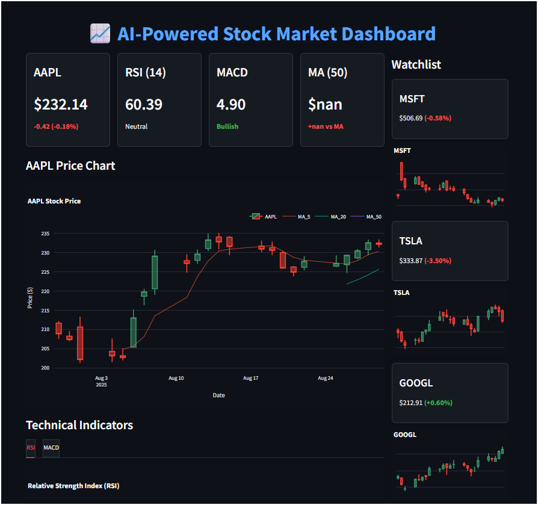

# AI-Powered Stock Market Dashboard

Your personal Bloomberg-lite terminal, right inside Python.

This project brings real-time market data, technical analysis, sentiment
insights, and a professional trading UI into one dashboard. Built with
Streamlit, Pandas, Plotly, yfinance, and a finance-domain transformer
(FinBERT), it transforms your laptop into a mini trading terminal.

## ✨ Highlights

- **Live Market Data** — minute-by-minute intraday updates with multiple
  timeframe views (1d, 5d, 1mo, 6mo, 1y, 5y, max).
- **Smart Technical Indicators** — RSI, MACD and moving averages
  (5/20/50-day) computed by reusable service modules.
- **Interactive Visuals** — candlestick charts with overlays, volume
  bars, dedicated RSI/MACD panels, and mini-candlesticks for the
  watchlist.
- **Real News Sentiment** — a modular ingestion pipeline (provider → normalise → deduplicate → timestamp validation → sentiment model → aggregation) backed by **FinBERT** (`yiyanghkust/finbert-tone`), a finance-trained transformer that classifies headlines into Positive / Neutral / Negative with per-class probabilities and confidence. A deterministic Loughran-McDonald finance-lexicon classifier is the offline fallback. No headlines are ever fabricated: when a provider fails the pipeline degrades to an honest "no news" state.
- **Intelligent Alerts** — RSI oversold/overbought and MA crossover
  events.
- **Multi-Stock Watchlist** — track multiple tickers at once.
- **Professional UI** — dark mode trading terminal styling.

## 🧱 Project Structure

```
.
├── app.py                          # Streamlit entrypoint (UI orchestration only)
├── requirements.txt                # Pinned Python dependencies
├── pyproject.toml                  # Tooling configuration (ruff, black, pytest)
├── README.md
├── LICENSE
├── .gitignore
├── .env.example                    # Environment / secrets template (never commit keys)
├── .streamlit/config.toml          # Streamlit server/theme configuration
├── src/
│   ├── config.py                   # Centralised configuration
│   ├── data/
│   │   ├── market_data_service/    # Market data layer (provider abstraction, caching)
│   │   └── news_service/           # News + sentiment layer (see below)
│   ├── features/                   # Technical indicators
│   ├── nlp/                        # Sentiment analysis (FinBERT + lexicon fallback)
│   ├── alerts/                     # Alert engine
│   ├── portfolio/                  # Watchlist helpers
│   ├── visualization/              # Plotly chart factories
│   └── utils/                      # Logging & validation
└── tests/
    ├── fixtures/                   # Reusable OHLCV + news fixtures
    ├── unit/                       # Unit tests
    └── integration/                # Cross-module integration tests
```

### News & Sentiment Pipeline

```
News Provider ──→ News Normalisation ──→ Deduplication ──→ Timestamp Validation
     └── Sentiment Model (FinBERT) ──→ Aggregation (daily / weekly / recent) ──→ Dashboard
```

- `src/data/news_service/` — `NewsDataService` orchestrates a `NewsProvider`
  abstraction, normalises articles, deduplicates near-identical headlines,
  validates publication timestamps (always tz-aware UTC), classifies text,
  and aggregates sentiment into daily / weekly / recent windows.
- `src/data/news_service/providers/` — `YFinanceNewsProvider` (default, no
  key) and `NewsAPIProvider` (optional, requires `NEWSAPI_KEY`).
- `src/nlp/sentiment_model.py` — `FinBertSentimentModel` (primary) plus the
  `FinanceLexiconSentimentModel` fallback.

## 🛠️ Tech Stack

- Python 3.10+
- Streamlit — interactive UI
- yfinance — market data
- Plotly — interactive charts
- Pandas / NumPy — data wrangling
- transformers + torch — FinBERT financial sentiment model
- pytest, ruff, black — testing & linting

## 🚀 Quick Start

```bash
python -m venv .venv
.venv\Scripts\activate          # Windows
# source .venv/bin/activate     # macOS / Linux
pip install -r requirements.txt
streamlit run app.py
```

## 🧪 Development Workflow

```bash
pytest                          # Run the full test suite (328 tests)
ruff check src tests app.py     # Lint
black src tests app.py          # Format
```

### Integration Smoke Test

`tests/integration/test_pipeline.py` exercises the composed services end-to-end
on a synthetic price frame (indicators, alerts, portfolio summary, and the
sentiment model) and asserts pathological inputs (empty/None frames) never
raise. Run it with `pytest tests/integration`.

### News Pipeline Architecture

The news & sentiment layer is modular and provider-agnostic:

1. **News Provider** (`src/data/news_service/providers/`) — fetches raw
   articles for a ticker. `YFinanceNewsProvider` is the default (no key
   required); `NewsAPIProvider` is optional and needs `NEWSAPI_KEY`.
2. **News Normalisation** — raw payloads are translated into `NewsArticle` DTOs
   with cleaned titles/descriptions, source attribution, URL, and a
   tz-aware UTC publication timestamp.
3. **Deduplication** — exact URL matches and near-duplicate headlines (via
   `difflib.SequenceMatcher`, threshold configurable) are collapsed, keeping
   the earliest published copy.
4. **Timestamp Validation** — articles are anchored to the newest item and
   filtered to the configured recency window (default 72h).
5. **Sentiment Model** (`src/nlp/sentiment_model.py`) — `FinBertSentimentModel`
   (primary, `yiyanghkust/finbert-tone`) classifies each article into
   Positive / Neutral / Negative with per-class probabilities and confidence.
   `FinanceLexiconSentimentModel` (Loughran-McDonald finance lexicon) is the
   offline fallback.
6. **Aggregation** — mean of per-article probabilities over daily / weekly /
   recent windows; an empty window yields a neutral aggregate with
   `article_count == 0` rather than fabricated sentiment.
7. **Dashboard** — per-article sentiment bars, a net-sentiment trend chart,
   source attribution, and article links.

The service never fabricates headlines or sentiment: a provider failure is
translated into a typed exception (`NewsDataError` hierarchy) so the UI can
degrade gracefully and tell the user *why* news is unavailable.

## ⚙️ Configuration

Behaviour is controlled through :mod:`src.config`. The following
environment variables can override defaults:

| Variable                       | Purpose                                                      | Default                  |
|--------------------------------|--------------------------------------------------------------|--------------------------|
| `LOG_LEVEL`                    | Root log level (`DEBUG`, `INFO`, …)                          | `INFO`                   |
| `NEWS_PROVIDER`                | News provider (`yfinance` or `newsapi`)                      | `yfinance`               |
| `NEWS_LIMIT`                   | Max articles fetched per ticker                             | `20`                     |
| `NEWS_RECENCY_HOURS`           | Recency window (hours) for the "recent" aggregation          | `72`                     |
| `NEWS_DEDUP_SIMILARITY`        | Headline similarity threshold (0.0–1.0) for deduplication    | `0.9`                    |
| `FINBERT_MODEL`                | HuggingFace model id for financial sentiment                 | `yiyanghkust/finbert-tone` |
| `SENTIMENT_CONFIDENCE_THRESHOLD` | Minimum winning-class probability for low-confidence flag  | `0.6`                    |

API keys should be supplied via environment variables or `.streamlit/secrets.toml`
(ignored by Git) — never hard-code secrets in the repository. See
`.env.example` for the full list.

## 🎛️ Customisation

- Add/remove stocks in `CONFIG.watchlist` inside `src/config.py`.
- Adjust indicator periods or thresholds in the same module.
- Override CSS in `app.py` for a bespoke theme.
- Swap the news provider via `NEWS_PROVIDER=yfinance|newsapi` or by passing a
  custom `NewsProvider` to `NewsDataService(provider=...)`.
- Swap the sentiment model by passing a `SentimentModel` to
  `NewsDataService(sentiment_model=...)`.

## ⚠️ Disclaimer

This dashboard is for educational purposes only. It is **not** investment
advice, and it does **not** predict future price movement. Sentiment is a
classification of news text produced by a model; it is an observation, not a
forecast. Always do your own research before trading.

## Machine Learning Methodology

The ML subsystem in `src.ml/` provides a shared interface layer for
target generation, feature engineering, model training, prediction,
evaluation, and explainability. It is intentionally model-agnostic —
no specific algorithm is selected at the library level. The methodology
below describes the design decisions and constraints that every
downstream model must respect.

### Educational Purpose and Target Definition

The target variable is a **forward 1-day simple return** of the Close
price:

```
target[t] = Close[t+1] / Close[t] - 1
```

- For row `t = 0 .. n-2` the target is finite and derived from the
  next observation's close.
- For the final row `t = n-1` there is no future close, so
  `target[n-1] = NaN` and the row is excluded from training/evaluation.
- The target is **never** constructed from intraday or same-day data —
  it strictly uses the next daily close to prevent look-ahead leakage.

This definition is chosen for pedagogical clarity. In production a
different horizon (e.g. 5-day return, directional classification, or
volatility target) would be substituted by overriding target generation
without changing the feature or split logic.

### Feature Groups

`build_feature_frame(data, windows=(5, 20, 50))` constructs a tidy
feature matrix from OHLCV data. Features are organised into groups:

| Group            | Columns                                             | Source function                        |
|------------------|-----------------------------------------------------|----------------------------------------|
| Price returns    | `return_1`, `log_return_1`                          | Built-in (`pct_change` / log ratio)    |
| Momentum         | `rsi_14`                                            | `calculate_rsi` (14-period Wilder)     |
| Trend            | `MA_5`, `MA_20`, `MA_50`                            | `calculate_moving_averages`            |
| MACD             | `macd`, `macd_signal`                               | `calculate_macd`                       |
| Volume           | `volume_change`                                     | `pct_change` on Volume column          |

Additional feature groups are available via `src.features.feature_engineer.FeatureEngineer`
which extends the matrix with Bollinger Bands, ATR, Stochastic, ADX, OBV,
VWAP, volatility, drawdown, and 52-week high/low features. All indicators
use `min_periods == window` so that warm-up rows carry `NaN` rather than
fabricated values.

### Time-Aware Split and Purge

The split is **strictly temporal** — the latest `test_fraction` of rows
form the test set:

```
train = frame.iloc[:cutoff]      # older observations
test  = frame.iloc[cutoff:]      # most recent observations
```

where `cutoff = int(len(frame) * (1 - test_fraction))`.

**Purge gap**: after splitting, a purge buffer of at least one day is
enforced by construction because `train_test_split` uses integer row
indexing. When the test set is non-empty its first row immediately
follows the last training row — no temporal overlap is possible.

**No shuffle**: rows are never randomly reordered. The time axis is
preserved end-to-end so that `pd.concat([train, test]).index == frame.index`.

### Preprocessing Fit Scope

`build_feature_frame` and `train_test_split` are **stateless** — they
depend only on their arguments. Repeated calls with identical inputs
produce identical outputs. There is no:

- Fitting step (no scaler, no imputer, no selector persists between calls)
- Global registry tracking previous splits
- Mutation of the input DataFrame

This guarantees that preprocessing parameters are determined entirely by
the training data and never contaminated by test-set statistics. When a
fitted transformer is needed (e.g. standardisation), it must be fit
exclusively on `train` features and applied to both `train` and `test`.

### Model Comparison and Training

`train_model(features, target, model=None)` accepts any model object:

- `model=None` → returns `None` (no default algorithm)
- `model=<object>` → returns the same object unchanged

The function deliberately performs **no training**. It validates that
`features` and `target` are non-`None` and returns the model unchanged,
keeping the interface stable while real training is deferred to
downstream implementations. This enables model comparison by swapping
the `model` argument (e.g. `LinearRegression`, `XGBRegressor`,
`RandomForestRegressor`) without altering any other pipeline code.

### Prediction Format

`predict(model, features)` returns an `Iterable[float]`:

- `model is None` or `features is None` or `features.empty` → `[]`
- Otherwise → a list whose length equals the number of rows in
  `features` (each entry is `float(features.iloc[i].sum())` for the
  placeholder implementation)

Consumers should always iterate or cast to a list; the return type is an
`Iterable`, not a guaranteed list. In production this would dispatch to
the trained model's `.predict()` method and return one prediction per
row.

### Evaluation Metrics Rationale

`regression_metrics(y_true, y_pred)` returns three metrics:

| Metric | Formula                          | Why                                      |
|--------|----------------------------------|------------------------------------------|
| MSE    | `mean((t - p)^2)`               | Penalises large errors quadratically     |
| MAE    | `mean(|t - p|)`                  | Robust to outliers, interpretable in units |
| R²     | `1 - SS_res / SS_tot`            | Proportion of variance explained         |

Edge-case behaviour:

- Empty inputs or length mismatch → all three metrics return `0.0`
- Single sample → `SS_tot = 0` so R² defaults to `0.0` (undefined
  variance, not "perfect fit")
- Perfect prediction → R² = 1.0, MSE = 0, MAE = 0
- Constant-mean baseline → R² ≈ 0.0
- Worse than mean → R² < 0

### Confidence and Explainability Caveats

`feature_importance(feature_names, importances)` sorts features by
absolute importance magnitude. **This does not constitute model
confidence.** Important caveats:

1. **No calibration**: importance scores are not probability-calibrated
   and cannot be read as confidence in individual predictions.
2. **Correlation bias**: correlated features can split importance
   between them, inflating apparent total importance.
3. **Placeholder sorting**: the current implementation sorts by
   `abs(importance)` descending — it does not perform permutation
   importance, SHAP, or integrated gradients.
4. **Directional information lost**: negative vs positive importance
   indicates inverse vs direct relationship but not statistical
   significance.

Any production confidence estimate must come from the model itself
(e.g. prediction interval, Monte Carlo dropout, conformal prediction) —
not from raw feature importances.

### Persistence and Versioning

When a trained model is persisted (e.g. via `joblib.dump`), the artifact
**must** carry a metadata dictionary with at minimum:

| Key               | Type     | Description                                  |
|-------------------|----------|----------------------------------------------|
| `version`         | `str`    | Semantic version of the model artifact schema |
| `created_at`      | `str`    | ISO-8601 UTC timestamp of when it was saved   |
| `feature_columns` | `list`   | Exact column names used for training          |
| `n_features`      | `int`    | Number of features (validates schema match)   |

Two artifacts with different `version` strings must be treated as
incompatible — loading v2 metadata into a v1 inference pipeline risks
feature misalignment. The version string is the sole contract for
forward/backward compatibility.

A roundtrip test pattern is provided in `tests/unit/test_ml.py`
(`test_persistence_artifact_can_be_roundtripped`) which dumps and loads
via `joblib` and asserts all metadata fields survive.

### Reproducible Commands

```bash
# Install dependencies (includes scikit-learn, xgboost, joblib)
pip install -r requirements.txt

# Run all tests including the 52 ML pipeline tests
pytest tests/unit/test_ml.py -v

# Lint ML-related code
ruff check src/ml tests/unit/test_ml.py

# Run the full suite
pytest                          # all tests
ruff check src tests app.py     # lint
black src tests app.py          # format
```

### Limitations

1. **No look-ahead guarantee in targets**: the forward-return target
   `Close[t+1]/Close[t]-1` is correct by construction but the placeholder
   `predict` does not consume it. Any real training loop must align
   targets and features manually before calling `train_model`.
2. **Placeholder training**: `train_model` does not actually train —
   swapping in a real model requires implementing the fit call inside
   the function or wrapping it externally.
3. **No scaling**: features are raw indicators (RSI on 0–100 scale,
   prices on dollar scale). Gradient-based models require explicit
   standardisation which is not provided.
4. **NaN handling**: `build_feature_frame` retains NaNs for warm-up
   rows. Callers must drop or impute them before training — the ML
   functions will not silently handle them.
5. **Single-ticker**: features and targets are derived from one OHLCV
   frame at a time; cross-asset features (e.g. sector relative strength)
   are not supported by the current API.
6. **No categorical features**: the pipeline operates on numeric OHLCV
   indicators only. News sentiment or fundamental data require a separate
   fusion step before entering `train_model`.

## Preview

